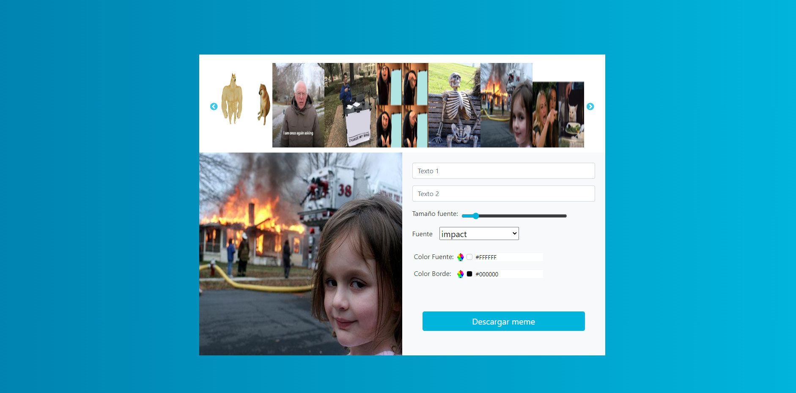
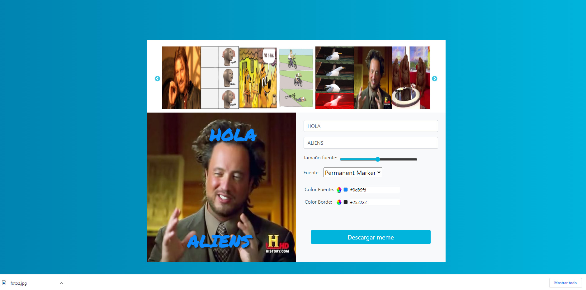
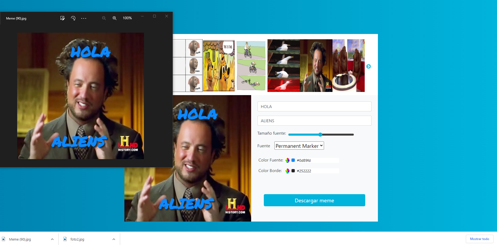
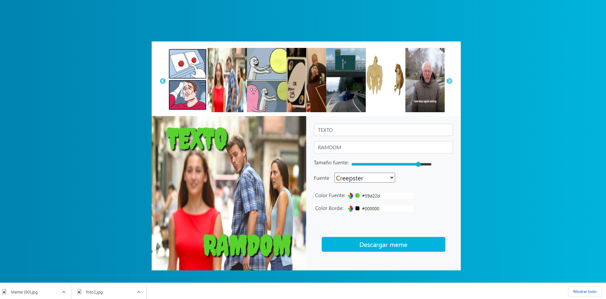

Link al proyecto en github pages:
https://diegodelias.github.io/GeneradorMemesCodoACodoReact2022/

Tener en cuenta al probar que los textos se posicionan haciendo drag and drop

Link a video Demo del ejercicio
https://www.youtube.com/watch?v=4ijecpN8H98

Algunas cosas que quedaron mejorar:
- Carga aleatoria de las fotos en el slider
- Implementar funcionalidad para agregar más textos
- Mejorar posicionamiento por defecto y limites de los textos al hacer drag and drop
- entre otras cosas..

Link video guia deploy proyecto React Vite en github pages:
https://www.youtube.com/watch?v=e3SV6tYztz0&t=906s
